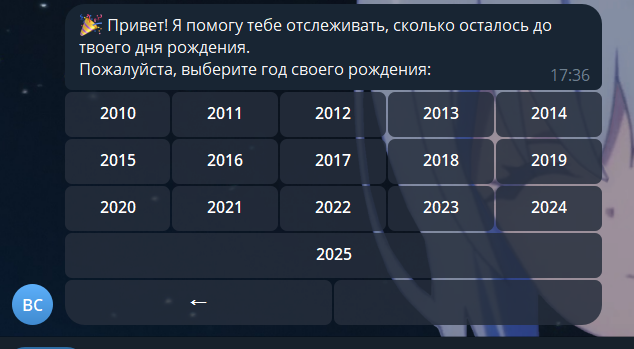
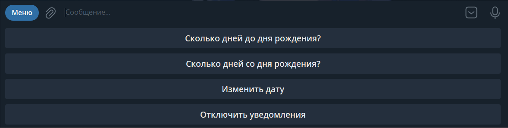

# BirthdayBot 🎂

Telegram-бот для отслеживания дней до дня рождения с поддержкой часовых поясов и красивым календарём!

## Возможности
- Регистрация с выбором даты рождения через удобный календарь
- Указание своего часового пояса (по городу или геолокации)
- Ежедневные уведомления: сколько дней осталось до дня рождения
- Изменение даты рождения и часового пояса в любой момент
- Поддержка команд:
  - `/start` — начать регистрацию
  - `/menu` — показать главное меню
  - `/timezone` — изменить часовой пояс
- Современный UX: все основные действия доступны через кнопки и команды

## Как запустить

1. **Клонируйте репозиторий и перейдите в папку проекта:**
   ```sh
   git clone <repo-url>
   cd BirthdayBot
   ```
2. **Создайте виртуальное окружение и активируйте его:**
   ```sh
   python -m venv .venv
   # Windows:
   .venv\Scripts\activate
   # Linux/macOS:
   source .venv/bin/activate
   ```
3. **Установите зависимости:**
   ```sh
   pip install -r requirements.txt
   ```
4. **Создайте файл `.env` и добавьте токен Telegram-бота:**
   ```env
   BOT_TOKEN=ваш_токен_бота
   ```
5. **Запустите бота:**
   ```sh
   python main.py
   ```

## Пример использования

- `/start` — регистрация, выбор даты рождения через календарь, указание часового пояса
- `/menu` — показать главное меню (список команд)
- `/timezone` — изменить часовой пояс
- Кнопки для быстрого доступа к функциям

## Скриншоты




## Технологии

- Язык: **Python 3.10+**
- Фреймворк: **aiogram 3.x** (асинхронный Telegram Bot API)
- Планировщик задач: **APScheduler**
- Работа с БД: **sqlite3**
- Работа с часовыми поясами: **pytz**, **timezonefinder**
- Парсинг .env: **python-dotenv**
- HTTP-запросы: **requests**


### Мой бот

- Телеграм: **@BirthdayCountdownBot_bot**
